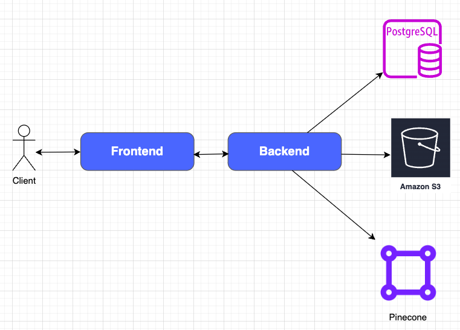

# PDF AI

Integrated with Langchain to utilize OpenAI API or Llama to read PDF.

## [Demo](assets/readme.md)

## Architecture

The project include several components and they can be visualized as below.


### Key Components

**Backend**

Two major components for the backend server are Flask and Langchain. Flask is used to build all REST endpoints and Langchain is used to interact with LLMs.

**PostgreSQL**

Postgres is used to store metadata including user information and PDF metadata that user uploaded.

**AWS S3**

All uploaded PDFs are stored in S3.

**Pinecone**

Pinecone as a vector database is used to store vector embedding of each PDF document, which is then used for retrieving relevant contents from PDF based on user's questions.

## Local Setup

### Prerequisites

Make sure you have the following items downloaded.

- Python3
- Docker

### Setup

1. create a `.env` file with global variables from `env-var-list`.
2. Create a virtual environment.

```sh
python -m venv .venv
```

3. Activate virtual environment with

```sh
source .venv/bin/activate
```

4. Start up Postgres and Redis instance with `inv run-local-infra`.
5. Initialize database with `inv init-db`.
6. Start the application with `inv dev`.
7. Open a new terminal (make sure to activate the virtual env), start celery worker with `inv devworker`
