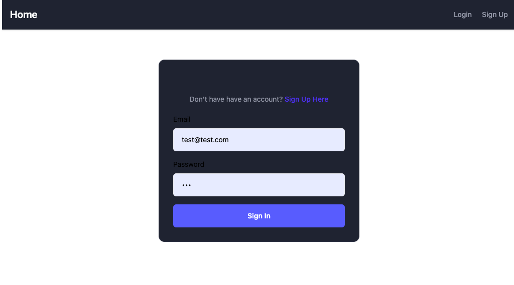
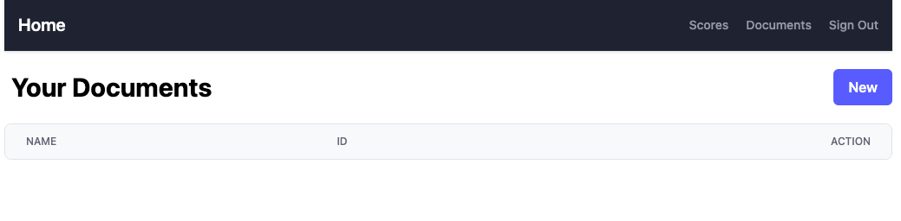
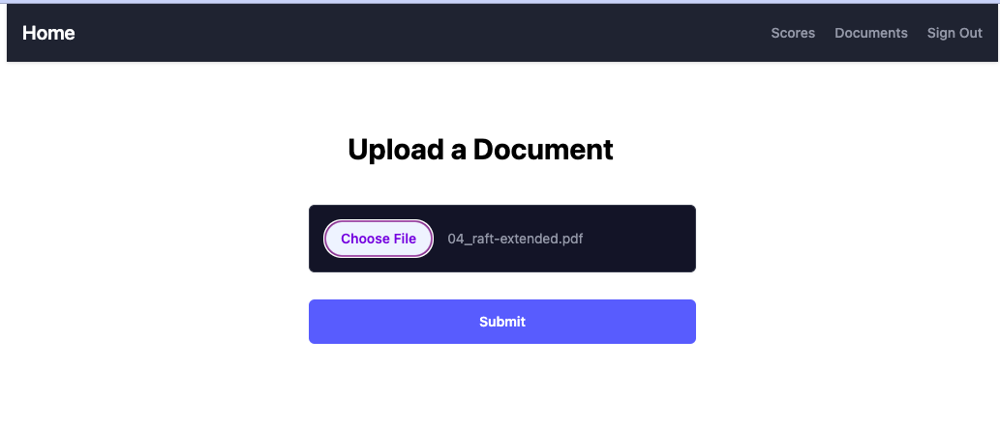
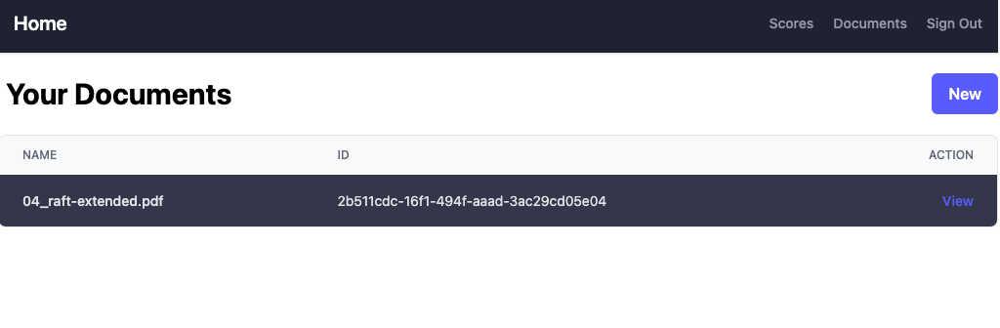
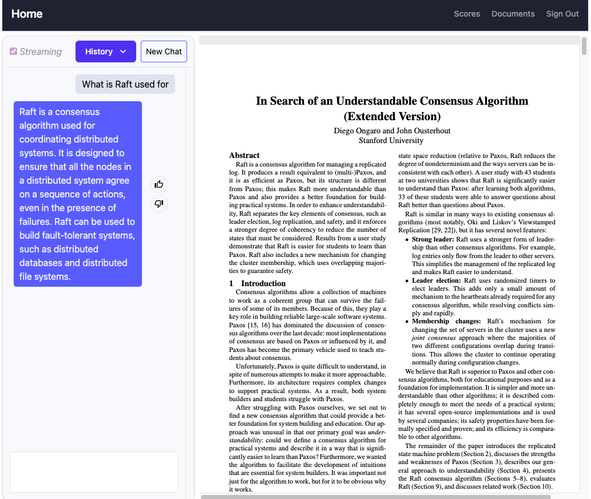

# Demo

### User Login

When user first access the UI, they need to register/login to interact with the application.

### Upload PDFs

After logging into the application, user are able to upload pdfs and see a list of PDFs they uploaded.

### List of PDFs and Chat with LLMs about it

Then user are able to find a list of PDFs they have uploaded and behind the scene, the backend will use knowledge from the PDF to answer user's questions.

